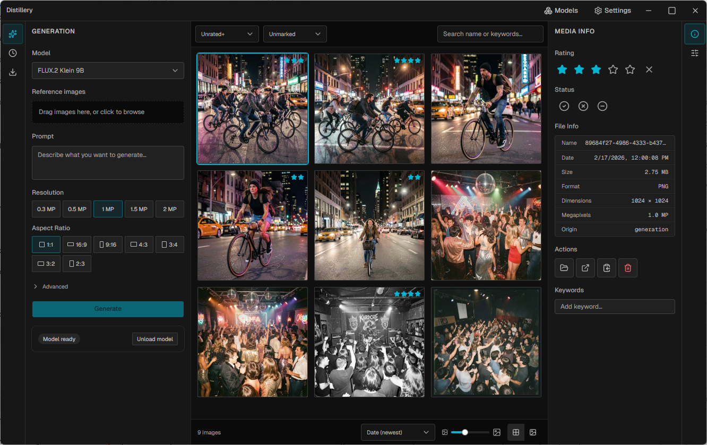

# Distillery

A desktop application for local AI image generation and media management. Generate images with FLUX models running entirely on your hardware — no cloud, no API keys, no subscriptions — and manage the results in a fast, Lightroom-inspired media library.



## What it does

Distillery pairs a purpose-built local inference engine with a proper media library. You type a prompt, images land in your library, and you can browse, cull, rate, and organize them with keyboard-driven workflows designed for fast creative iteration.

- **Fully local generation** — Runs [condenser.cpp](https://github.com/jcluts/condenser.cpp) (also my project) as a persistent child process, keeping models resident in VRAM across generations
- **Media library** — Virtualized grid and loupe views, star ratings, pick/reject flags, filtering, and keyboard shortcuts inspired by professional photo culling workflows
- **Model management** — Built-in download manager for GGUF-quantized FLUX.2 Klein models (4B and 9B) with multiple quant levels
- **Work queue** — Persistent task queue that survives restarts, with real-time progress tracking
- **Import support** — Drag-and-drop or manual import of existing images into the managed library
- **Multi-profile** — Isolated workspaces with independent databases and libraries

## Tech stack

Electron · React 19 · TypeScript · Tailwind 4 · shadcn/ui · Zustand · better-sqlite3 · sharp · @tanstack/react-virtual

The AI inference backend is [condenser.cpp](https://github.com/jcluts/condenser.cpp), a lightweight GGML-based engine I built specifically for this project to run quantized diffusion models via an NDJSON-over-stdio protocol.

## Getting started

```bash
npm install
npm run dev
```

On first launch, open the model manager to download a FLUX.2 Klein model. Generation requires a Vulkan-capable GPU.

## Building

```bash
npm run build:win    # Windows
npm run build:mac    # macOS
npm run build:linux  # Linux
```

## Status

Early-stage / active development. This is a personal project — functional but evolving. Feedback welcome.

